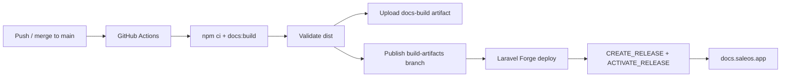

# SaleOS Docs

Official documentation site for the **SaleOS** SaaS platform, built with [VitePress](https://vitepress.dev/).

**Production URL:** [https://docs.saleos.app](https://docs.saleos.app)

## Requirements

| Tool | Version |
|------|---------|
| Node.js | **20+** / latest LTS (CI uses `lts/*`) |
| npm | 10+ |

## Local development

```bash
npm ci
npm run docs:dev
```

Open the URL printed in the terminal (default `http://localhost:5173`).

## Local production build

```bash
npm ci
npm run docs:build
```

Static output:

```text
docs/.vitepress/dist
```

Preview:

```bash
npm run docs:preview
```

`main` stays **source-only**. Do not commit `docs/.vitepress/dist`.

## GitHub Actions build pipeline

Merges into **`main`** (and manual **workflow_dispatch**) run [`.github/workflows/docs-build.yml`](./.github/workflows/docs-build.yml).

The workflow:

1. Checks out the repository
2. Sets up Node.js LTS with npm cache
3. Runs `npm ci`
4. Runs `npm run docs:build` and fails on build errors / warning patterns
5. Writes `build-info.json` into the dist folder
6. Validates that `docs/.vitepress/dist` exists and contains production files (`index.html`, `sitemap.xml`, `robots.txt`, `404.html`)
7. Scans the artifact for secret-like material
8. Uploads GitHub Actions artifact `docs-build` (30-day retention)
9. Publishes **only** the contents of `docs/.vitepress/dist` to the **`build-artifacts`** branch

The deploy branch never includes `node_modules`, Markdown/TypeScript sources, `package.json`, workflows, or README.

This matches the SaaS-Frontend strategy: **build in CI, deploy compiled assets only**.

## Laravel Forge deployment

Forge should deploy from the **`build-artifacts`** branch (not `main`). The server must **not** run npm or VitePress.

### Deploy script (minimal)

```bash
$CREATE_RELEASE()

cd $FORGE_RELEASE_DIRECTORY

$ACTIVATE_RELEASE()
```

No `npm ci`, no `npm install`, no `npm run docs:build`, no Node.js build.

### Web root

Because the `build-artifacts` branch root **is** the compiled site, set the Forge **Web Directory** to:

```text
/
```

(or leave empty / site root — **not** `docs/.vitepress/dist`)

### Clean URLs

VitePress uses `cleanUrls: true`. Nginx example:

```nginx
try_files $uri $uri.html $uri/ /index.html;
```

### Forge site settings checklist

| Setting | Value |
|---------|--------|
| Repository | `DiligentCreators/SaaS-Docs` |
| Branch | `build-artifacts` |
| Web Directory | `/` |
| Deploy script | `$CREATE_RELEASE()` → `$ACTIVATE_RELEASE()` only |
| Node.js on server | **Not required** for deploy |

Trigger a Forge deploy after each successful Actions publish to `build-artifacts` (Forge GitHub webhook or manual deploy).

## Required GitHub configuration

| Name | Type | Required | Purpose |
|------|------|----------|---------|
| `GITHUB_TOKEN` | Secret (automatic) | Yes | Push compiled assets to `build-artifacts` |
| `APP_VERSION` | Repository variable | No | Overrides `package.json` version in `build-info.json` |

No Forge SSH secrets are required in Actions — the same pattern as SaaS-Frontend: CI publishes the branch; Forge pulls it.

Ensure `github-actions[bot]` can push to `build-artifacts` (branch unprotected, or allow the bot).

## Deployment flow



```text
main (source)
    ↓  GitHub Actions
docs/.vitepress/dist (CI only)
    ↓  publish compiled files only
build-artifacts (deploy branch)
    ↓  Forge activate release
https://docs.saleos.app
```

## Recovery

| Situation | Action |
|-----------|--------|
| Need compiled files | Download Actions artifact `docs-build` |
| Rebuild without a code change | Actions → **Docs production build** → **Run workflow** |
| Forge showing stale site | Confirm site branch is `build-artifacts`, then redeploy |

## Project structure

```text
.
├── .github/workflows/docs-build.yml
├── docs/
│   ├── .vitepress/
│   │   ├── config.ts
│   │   ├── theme/
│   │   ├── public/
│   │   └── dist/          # local/CI build output (gitignored on main)
│   ├── index.md
│   ├── 404.md
│   ├── getting-started/
│   ├── architecture/
│   ├── user-guide/
│   ├── developer-guide/
│   ├── api/
│   ├── deployment/
│   ├── changelog/
│   └── assets/
├── package.json
├── package-lock.json
├── .gitignore
└── README.md
```

## Scripts

| Script | Description |
|--------|-------------|
| `npm run docs:dev` | VitePress dev server |
| `npm run docs:build` | Build static docs to `docs/.vitepress/dist` |
| `npm run docs:preview` | Preview the production build |

## Related repositories

- Backend: [SaaS-Backend](https://github.com/DiligentCreators/SaaS-Backend)
- Frontend: [SaaS-Frontend](https://github.com/DiligentCreators/SaaS-Frontend) (same `build-artifacts` CI pattern)
