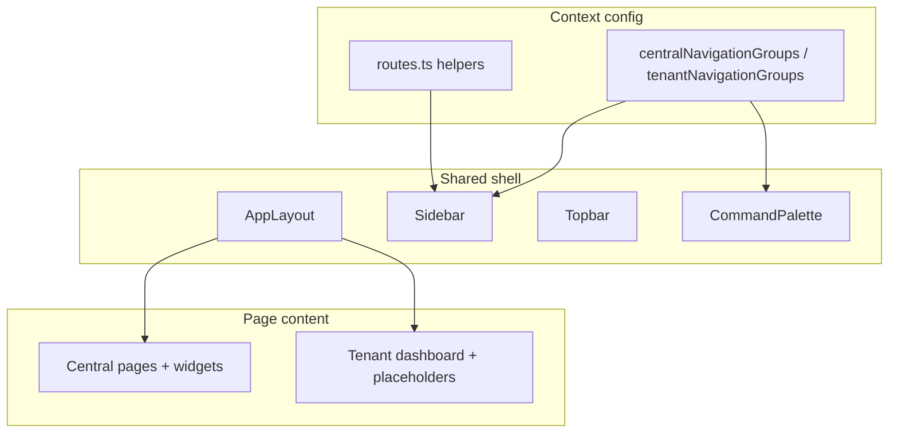

# Shared Design System & Layout Reuse

## Goal

Central and Tenant applications share one visual and structural foundation. Users moving between platform admin and workspace surfaces should recognize the same shell immediately.

Business functionality will differentiate the apps later; the shell must not require another layout refactor when that happens.

## Design system

| Concern | Shared source |
|---------|----------------|
| Colors, typography, spacing | Global CSS / Tailwind theme tokens |
| Primitives | `SaaS-Frontend/src/components/ui` |
| Page helpers | `components/common` (headers, empty/loading/error states) |
| App chrome | `layouts/app-layout.tsx` + `components/layout` |
| Motion / density | Same card radii, sidebar width, topbar height, content max-width |

Central-specific dashboard widgets (tenant analytics, platform health, marketplace shortcuts) stay in `components/dashboard` and are **not** reused on the Tenant dashboard.

Tenant dashboard reuses shell + `WidgetContainer` / `EmptyState` patterns with workspace-oriented placeholders.

## Layout reuse strategy

1. **One `AppLayout`** wraps both protected route trees.
2. **Navigation is data**, not duplicated components — swap groups by `AuthContext`.
3. **Route helpers** resolve dashboard / profile / settings / login per context.
4. **Business pages own their content**; they must not fork the shell.
5. **Placeholders** reserve sidebar destinations (Leads, Tasks, Tenant Settings) without implementing product logic.

## Evolution

| Phase | Central | Tenant |
|-------|---------|--------|
| Now | Platform metrics dashboard | Workspace placeholder dashboard |
| Later | Platform-focused metrics stay | Module-driven widgets (Leads, Tasks, Invoices, …) |
| Shell | Remains shared | Remains shared |

Installed module subscriptions will eventually drive Tenant sidebar visibility. Until then, only universally available modules (Leads, Tasks) plus Profile/Settings are listed.

## Related docs

- [ui/shared-layout.md](../ui/shared-layout.md)
- [ui/shared-layout-developer.md](../ui/shared-layout-developer.md)
- [ui/tenant-application-user.md](../ui/tenant-application-user.md)
- [admin-ui.md](../admin-ui.md)
