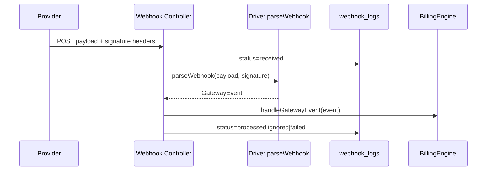

# Payment Gateway Webhooks

## Ingress points

| URL | Controller | Notes |
|-----|------------|-------|
| `POST /webhooks/gateways/{code}` | `GatewayWebhookController` | Gateway-agnostic extension point |
| `POST /stripe/webhook` | `StripeWebhookController` | Extends Cashier; also dispatches Billing Engine |

## Flow



## Normalized events

`GatewayEvent` types:

- `payment_succeeded` / `payment_failed`
- `subscription_created` / `subscription_updated` / `subscription_cancelled`
- `unsupported` (logged as ignored)

Drivers should populate `tenantId` when resolvable so `BillingEngine` stays provider-agnostic.

## Stripe events handled for billing activation

- `invoice.payment_succeeded`
- `invoice.payment_failed`
- `customer.subscription.*` (cancel → deactivate licensing)

Cashier still handles its own mirror tables on `/stripe/webhook`.

## Local development

```bash
stripe listen --forward-to https://your-app.test/stripe/webhook
# or
stripe listen --forward-to https://your-app.test/webhooks/gateways/stripe
```

Use the CLI webhook signing secret for local verification (`whsec_…`).
