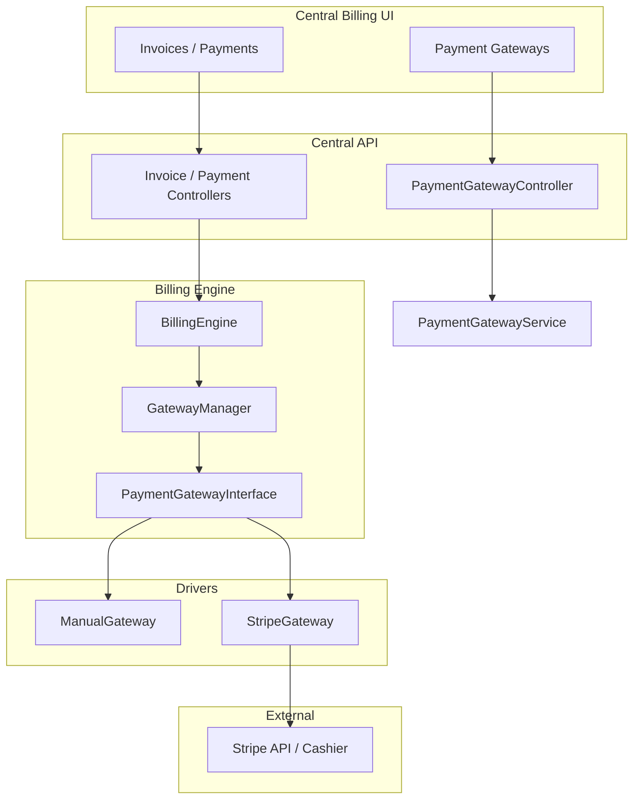
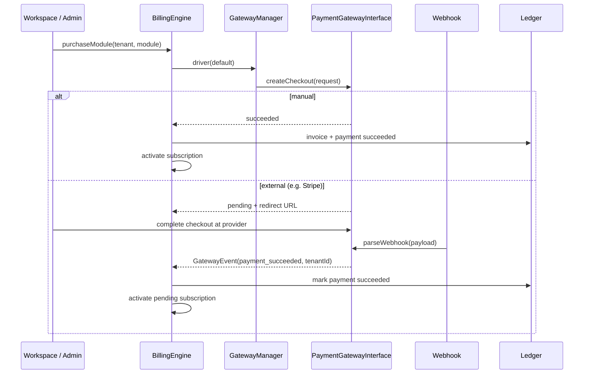
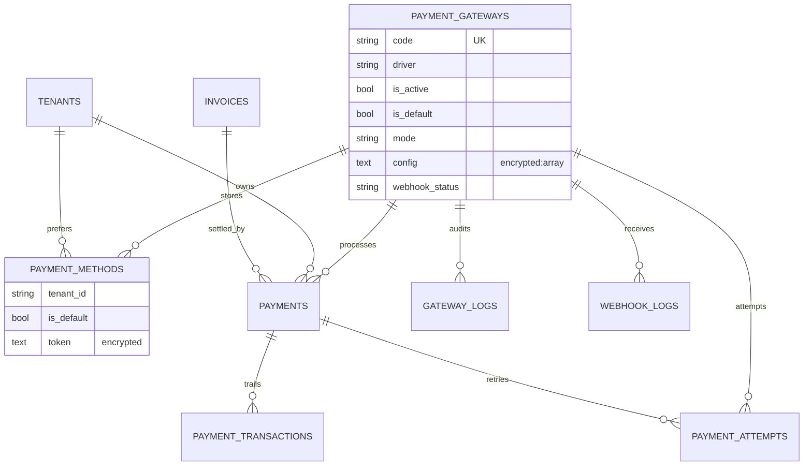

# Payment Gateway Architecture

Gateway-agnostic payment infrastructure for DC SaaS Central. The **Billing Engine talks only to `PaymentGatewayInterface`**. Stripe and Laravel Cashier live exclusively inside `StripeGateway`.

## Components

| Piece | Role |
|-------|------|
| `PaymentGatewayInterface` | Contract: checkout, refunds, webhooks, test connection, capabilities, currencies |
| `GatewayManager` | Resolves drivers by `payment_gateways.code`; binds encrypted config onto the driver |
| `BillingEngine` | Purchase / consolidate / handle normalized `GatewayEvent` — **no Stripe/Cashier imports** |
| `StripeGateway` | Cashier Checkout + Stripe SDK + webhook normalization |
| `ManualGateway` | Synchronous offline settlement |
| `PaymentGatewayService` | Admin enable/disable/default/config/mode/test/logs |
| `GatewayWebhookController` | `POST /webhooks/gateways/{code}` → driver → Billing Engine |
| `StripeWebhookController` | Cashier-compatible `/stripe/webhook` + Billing Engine dispatch |

## Architecture

## Checkout / activation sequence

## ER (gateway-agnostic)

> `payment_methods` **is** the workspace preferred-method table (`tenant_id` + `is_default`). No separate `workspace_payment_methods` table.

## Adding a new gateway

1. Implement `App\Billing\Drivers\{Name}Gateway extends AbstractGateway`.
2. Register in `config/core-platform.php` → `payment_gateways`.
3. Seed a `payment_gateways` row (`code`, `driver`, capabilities, currencies).
4. Point provider webhooks to `POST /webhooks/gateways/{code}`.
5. **Do not** change `BillingEngine`.

## Related docs

- [Developer guide](payment-gateways-developer.md)
- [User guide](payment-gateways-user.md)
- [Production guide](payment-gateways-production.md)
- [Webhook reference](payment-gateways-webhooks.md)
- [Billing Engine](billing-engine.md)
- [Stripe / Cashier notes](stripe-cashier.md)
