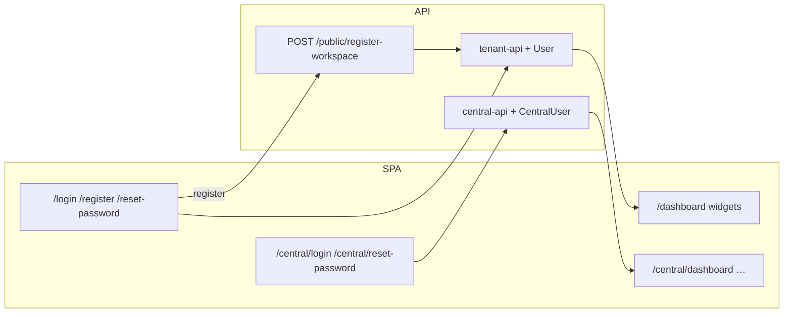

# Authentication

Tenant and Central authentication are fully isolated: separate route trees, Sanctum guards, user models, password-reset brokers, and SPA token storage.

## Architecture

| Concern | Tenant Application | Central Application |
|---------|--------------------|---------------------|
| SPA routes | `/login`, `/register`, `/forgot-password`, `/reset-password/{token}` | `/central/login`, `/central/forgot-password`, `/central/reset-password/{token}` |
| API prefix | `/api/tenant/v1` | `/api/central/v1` |
| Guard | `tenant-api` | `central-api` |
| User model | `App\Models\User` (`users`) | `App\Models\CentralUser` (`central_users`) |
| Password broker | `users` | `central_users` |
| SPA token key | `dc_saas_token_tenant` | `dc_saas_token_central` |
| Token name | `tenant-token` | `central-token` |

A tenant login never authenticates a Central administrator, and a Central login never authenticates a tenant user.

`/login` is the shared tenant entry point. It includes a **Workspace** field when the browser host does not already resolve a workspace; `/central/login` is always reserved for platform administrators and never accepts a workspace.

## Guards

Defined in `config/auth.php`:

- `central-api` — Sanctum driver, `central_users` provider
- `tenant-api` — Sanctum driver, `users` provider

Tenant routes also run `tenancy` + `tenant.available`. Workspace resolution prefers the request host (including future custom domains), then the authenticated token's workspace, then the submitted `workspace` value or `X-Tenant-Domain` header. Central routes run `central.domain`.

Spatie roles/permissions are isolated by `guard_name` (`central-api` vs `tenant-api`).

## Registration

`POST /api/central/v1/public/register-workspace` (honours `registration_enabled`):

1. Creates workspace + domain
2. Provisions default modules (Leads, Tasks) + billing profile
3. Ensures tenant roles/permissions
4. Creates workspace owner (`User`) with `superadmin` role
5. Returns Sanctum `tenant-token` for immediate SPA login

Required body fields: `company_name`, `owner_name`, `email`, `password`, `password_confirmation`.

When registration is disabled, the API returns 403 with message *We are not currently accepting new registrations.* The SPA `/register` route redirects to `/registration-closed`.

## Password reset

| Step | Tenant | Central |
|------|--------|---------|
| Request | `POST /api/tenant/v1/auth/forgot-password` | `POST /api/central/v1/auth/forgot-password` |
| Email link | `{FRONTEND_URL}/reset-password/{token}?email=` | `{FRONTEND_URL}/central/reset-password/{token}?email=` |
| Reset | `POST /api/tenant/v1/auth/reset-password` | `POST /api/central/v1/auth/reset-password` |

Both reset endpoints use `App\Rules\PasswordRule`, which reads Central settings (`password_min_length`, `password_require_special`) plus always-on complexity rules.

Set `FRONTEND_URL` in the backend `.env` so reset/invite emails open the SPA.

## Email verification

Tenant `User` and Central users implement `MustVerifyEmail`. Verification is required before protected Central and tenant application APIs can be used. Routes:

- `GET /api/tenant/v1/auth/email/verify/{id}/{hash}` (signed)
- `POST /api/tenant/v1/me/email/verification-notification` (self-service resend)
- `POST /api/tenant/v1/users/{user}/resend-verification` (`users.verify`; throttled `6,1`)
- `POST /api/tenant/v1/users/{user}/verify-email` (`users.verify`; manual mark verified)

Admin verify/resend cannot target self or (for non-owners) the workspace owner. Manual verify and resend write platform audit events `tenant_user_email_verified` / `tenant_user_verification_resent`.

## Impersonation compatibility

Login and registration issue tokens through `TenantAuthBootstrapService::issueAccessToken()`.  
`ImpersonationService::issueTenantAccessToken()` reuses the same helper for a future Central → Tenant handoff. Current impersonation endpoints still create audit sessions only.

## Token ↔ workspace binding

Sanctum tenant tokens are not intrinsically bound to a workspace. Authenticated tenant routes use middleware `tenant.user` (`EnsureTenantUserBelongsToCurrentTenant`) so a token issued for workspace A is rejected (401) when `X-Tenant-Domain` / host resolves to workspace B.

`InitializeTenancy` re-resolves the tenant on every request and switches context when the domain/header changes (important for SPA clients that keep one API host and swap `X-Tenant-Domain`).

The SPA does not persist a workspace identifier in `localStorage`. It derives workspace context from the current host or the explicitly supplied login/request workspace, preventing stale browser state from selecting a different workspace.

## Rate limiting

- Login: `throttle:auth-login` (5/minute by email or IP)
- Forgot/reset password: `throttle:6,1`
- Register workspace: `throttle:10,1`

## Tenant dashboard

`GET /api/tenant/v1/dashboard` (auth + verified + subscription + `dashboard.view`) returns welcome copy, workspace info, installed modules, a **widget registry** (module + permission + assignee scoped), and overall `scope`. See [tenant-v1-dashboard.md](/api/tenant-v1-dashboard).
