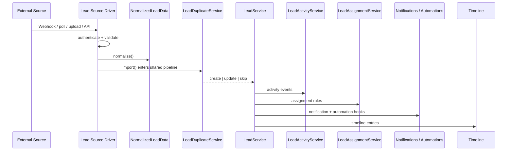

# Lead Source Driver Architecture

> **Status: Architectural decision — not implemented**
>
> This document defines the **official Lead Source Driver Architecture** for SaleOS. It is an architectural decision only. No driver registry, interface, or DTO exists in application code today. Do not treat class names below as shipped runtime APIs until an implementation PR lands and this status is updated.
>
> This architecture becomes the **standard for every future lead ingestion mechanism**. Source-specific integrations (including [Meta Lead Ads](/developer-guide/meta-lead-ads-integration)) must conform to it rather than embedding parsing logic inside the Leads module.

---

## Purpose

Every external lead source must pass through a **Lead Source Driver** before reaching the Lead module.

The Lead module must **never** contain source-specific parsing logic (Meta field maps, CSV column quirks, WhatsApp payload shapes, form-plugin schemas, CRM export formats, and so on).

| Layer | Owns |
|-------|------|
| **Driver** | Authentication, receiving data, validation, normalization into a common shape |
| **Lead module** | Duplicate detection, creation, assignment, activities, notifications, automations, timeline, business rules |

Business logic remains **centralized** inside the Lead module. Drivers are adapters at the edge.

---

## LeadSourceDriverInterface

Proposed architectural contract. Actual method names may change during implementation — these responsibilities define the contract, not a finalized PHP API.

| Responsibility | Intent |
|----------------|--------|
| `authenticate()` | Establish or verify credentials / connection context for the source |
| `validate()` | Reject malformed or unauthorized inbound payloads before normalization |
| `normalize()` | Map source-specific data into `NormalizedLeadData` |
| `import()` | Hand normalized data into the shared ingestion pipeline (never direct DB writes) |
| `supportsWebhook()` | Whether this driver accepts push ingress (webhooks) |
| `supportsPolling()` | Whether this driver may pull / poll the external system |

Drivers that only support one ingress mode return the appropriate capability flags. Shared infrastructure (webhook router, polling scheduler) consults these capabilities rather than hard-coding source names in the Lead module.

---

## Ingestion pipeline

Every lead — regardless of origin — follows the same pipeline after the driver produces normalized data:

```text
Incoming Lead Source
        ↓
Lead Source Driver
        ↓
NormalizedLeadData DTO
        ↓
LeadDuplicateService
        ↓
LeadService
        ↓
LeadActivityService
        ↓
LeadAssignmentService
        ↓
Notification System
        ↓
Automation Engine
        ↓
Timeline
```

### Non-negotiable rules

- **No driver may bypass this pipeline.**
- **No driver may insert records directly into the database.**
- **All lead creation must pass through `LeadService`.**

Duplicate detection, assignment, activity logging, notifications, and automations are Lead-module (or platform) concerns invoked **after** normalization — not inside the driver.

### Sequence (conceptual)



Service names such as `LeadActivityService` and `LeadAssignmentService` describe **ownership boundaries**. Implementation may map them to existing classes (`LeadService` methods, event subscribers, assignment helpers) as long as drivers never own those concerns.

---

## Future driver catalog

Planned drivers. Additional drivers may be introduced over time **without changing the Lead module** — only a new driver registration is required.

| Driver | Status | Notes |
|--------|--------|-------|
| Manual Lead Driver | Planned | SPA / API create path expressed as a driver (or thin adapter) |
| CSV Import Driver | Planned | Evolve today’s file import onto the shared pipeline |
| Public API Driver | Planned | External create API → normalize → pipeline |
| Website Form Driver | Planned | Generic hosted / embedded web forms |
| Meta Lead Ads Driver | Planned | First production implementation — see [Meta Lead Ads](/developer-guide/meta-lead-ads-integration) |
| WhatsApp Driver | Planned | Inbound lead capture from WhatsApp — see also [WhatsApp Cloud Integration](/developer-guide/whatsapp-cloud-integration) (messaging) |
| Google Ads Driver | Planned | Lead form extensions / offline import |
| Google Forms Driver | Planned | Form responses → leads |
| LinkedIn Lead Gen Driver | Planned | LinkedIn Lead Gen Forms |
| TikTok Lead Driver | Planned | TikTok lead generation ads |
| Gravity Forms Driver | Planned | WordPress Gravity Forms |
| Contact Form 7 Driver | Planned | WordPress CF7 |
| Elementor Forms Driver | Planned | Elementor form submissions |
| Typeform Driver | Planned | Typeform webhooks |
| Jotform Driver | Planned | Jotform webhooks |
| HubSpot Import Driver | Planned | CRM import / sync adapter |
| Salesforce Import Driver | Planned | CRM import / sync adapter |
| Zoho Import Driver | Planned | CRM import / sync adapter |
| Pipedrive Import Driver | Planned | CRM import / sync adapter |
| Custom Webhook Driver | Planned | Tenant-configured generic webhook → mapping UI |

Catalog entries are roadmap placeholders, not delivery commitments or shipped code.

---

## NormalizedLeadData DTO

Logical DTO produced by every driver. This is **not** a finalized class definition — field names and nesting may evolve during implementation. The contract is: drivers emit one common shape; the Lead module consumes only that shape.

### Identity

| Field | Purpose |
|-------|---------|
| `name` | Full name |
| `email` | Email address |
| `phone` | Phone number |
| `company` | Company name |

### Source

| Field | Purpose |
|-------|---------|
| `source` | Human / canonical source label (e.g. `Meta Lead Ads`) |
| `source_reference` | Driver / channel identifier |
| `external_id` | Idempotency key from the external system |

### Marketing attribution

| Field | Purpose |
|-------|---------|
| `campaign_id` | Campaign identifier |
| `campaign_name` | Campaign display name |
| `adset_id` | Ad set identifier |
| `adset_name` | Ad set display name |
| `ad_id` | Ad identifier |
| `ad_name` | Ad display name |
| `form_id` | Form identifier |
| `form_name` | Form display name |

### Tracking

| Field | Purpose |
|-------|---------|
| `utm_source` | UTM source |
| `utm_medium` | UTM medium |
| `utm_campaign` | UTM campaign |
| `utm_content` | UTM content |
| `utm_term` | UTM term |

### Metadata

| Field | Purpose |
|-------|---------|
| `custom_fields` | Source-specific questions / extras as structured data |
| `tags` | Suggested tags (applied by Lead rules, not by the driver writing tag rows) |
| `received_at` | When the platform received the submission |
| `payload` | Safe reference or redacted raw payload for audit / dead-letter diagnosis |

Illustrative shape:

```json
{
  "name": "Ada Lovelace",
  "email": "ada@example.com",
  "phone": "+1-555-0100",
  "company": "Analytical Engines",
  "source": "Meta Lead Ads",
  "source_reference": "meta_lead_ads",
  "external_id": "1234567890",
  "campaign_id": "...",
  "campaign_name": "...",
  "adset_id": "...",
  "adset_name": "...",
  "ad_id": "...",
  "ad_name": "...",
  "form_id": "...",
  "form_name": "...",
  "utm_source": null,
  "utm_medium": null,
  "utm_campaign": null,
  "utm_content": null,
  "utm_term": null,
  "custom_fields": {
    "budget": "10k-50k"
  },
  "tags": ["meta", "inbound"],
  "received_at": "2026-07-20T10:00:00Z",
  "payload": { "redacted": true }
}
```

---

## Driver responsibilities

Drivers **are** responsible for:

- Receiving payloads (webhook, poll, upload, API)
- Authentication
- Signature verification (when the source provides it)
- Token refresh / reconnect signaling
- Payload validation
- Mapping external fields
- Producing `NormalizedLeadData`

Drivers must **not** perform:

- Duplicate detection
- Assignment
- Notifications
- Automation
- Database writes
- Activity logging
- Stage calculation
- Business rules

---

## Core Lead responsibilities

The Lead module owns:

- Duplicate detection (`LeadDuplicateService`)
- Lead creation (`LeadService` only)
- Assignment
- Activities
- Notes
- Follow-ups
- Notifications
- Automation hooks
- Timeline
- Stage resolution
- Conversion
- Validation of business rules

Drivers stop at `NormalizedLeadData`. Everything after that is Lead / platform territory.

---

## Error handling

Standard failure path for normalization (and equivalent driver-side failures after auth succeeds):

```text
Failures during normalization
        ↓
Dead-letter queue
        ↓
Retry
        ↓
Alert
        ↓
Manual import if necessary
```

| Rule | Detail |
|------|--------|
| Idempotent drivers | Safe to reprocess the same external event |
| Duplicate webhook deliveries | Must not create duplicate leads (`external_id` + pipeline duplicate gate) |
| Auth / signature failure | Reject at the edge; do not enter the Lead pipeline |
| Poison messages | After retries, alert operators; allow manual recovery via existing import tools when needed |

---

## Extensibility principles

Adding a new lead source should require:

- **Creating a new driver**

Only.

| Principle | Meaning |
|-----------|---------|
| Open/Closed | Open to new sources via drivers; closed to Lead-module edits for each source |
| No duplication | Existing duplicate, assignment, notification, and activity logic is never reimplemented in a driver |
| Stable Lead core | New sources do not fork Lead validation, stages, or conversion rules |
| Registry growth | A driver catalog / registry grows; `LeadService` remains the single writer |

This mirrors the payment-gateway and email-driver patterns already used elsewhere on the platform: adapters at the edge, shared engine in the center — without redesigning the frozen foundation.

---

## Relationship with Meta Lead Ads

[Meta Lead Ads Integration](/developer-guide/meta-lead-ads-integration) is the first concrete consumer of this architecture.

- **`MetaLeadAdsDriver`** will be the **first production implementation** of the Lead Source Driver Architecture.
- Meta-specific OAuth, Page subscription, Graph fetch, and field mapping live **only** inside that driver.
- After `normalize()`, Meta leads use the same pipeline as every other source: `NormalizedLeadData` → `LeadDuplicateService` → `LeadService` → activities / assignment / notifications / automations / timeline.

Do not implement Meta Lead Ads by embedding Graph parsing inside `LeadService` or Lead controllers.

---

## Related

- [Meta Lead Ads Integration](/developer-guide/meta-lead-ads-integration)
- [WhatsApp Cloud Integration](/developer-guide/whatsapp-cloud-integration)
- [Leads — Developer Guide](/developer-guide/leads)
- [Product Roadmap](/getting-started/product-roadmap)
- [Module Architecture](/architecture/module-architecture)
- [Module Development Standard](/developer-guide/module-development)
- [Notification Architecture Contract](/developer-guide/notification-architecture-contract)
- [Documentation Governance](/developer-guide/documentation-governance)
