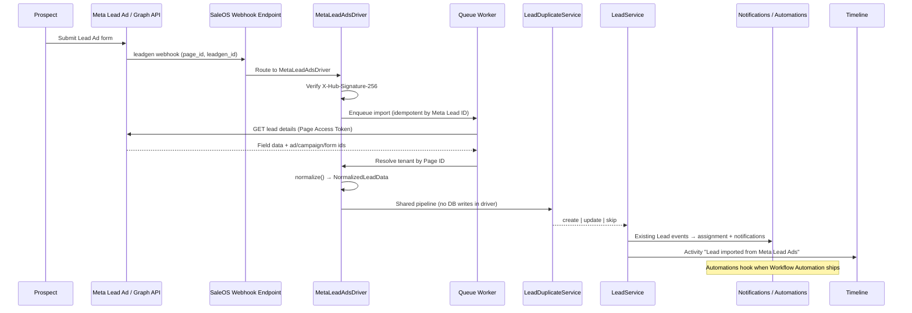

# Meta Lead Ads Integration

> **Status: Shipped**
>
> Tenant Meta OAuth, Page subscriptions, shared `POST/GET /webhooks/leads/meta`, `MetaLeadAdsDriver`, and queue `lead-ingest` are implemented. Central App credentials live in system settings / env (`META_LEAD_ADS_*`). Tenants customize `default_source` without reconnecting.

---

## Purpose

Allow each tenant to connect Meta (Facebook) assets so that **Lead Ad form submissions** arrive in SaleOS as first-class Leads — using the same duplicate detection, `LeadService` creation path, assignment, notifications, and activity timeline as manually created or CSV-imported leads.

**Goals:**

- Ingest Meta Lead Ads into the existing Leads module without a parallel lead store
- Implement ingestion as **`MetaLeadAdsDriver`** — the first production driver under the [Lead Source Driver Architecture](/developer-guide/lead-source-driver-architecture)
- Keep all Meta credentials and subscriptions **tenant-scoped**
- Verify webhook authenticity and process ingress asynchronously
- Attribute each lead to campaign / ad set / ad / form metadata
- Remain compatible with platform freeze (no foundation redesign)

**Non-goals (v1 of this integration):**

- Replacing CSV/XLSX import (that path later becomes the CSV Import Driver)
- Implementing Meta Conversions API (listed under [Future enhancements](#future-enhancements))
- Building a general-purpose marketing automation product
- Embedding Meta Graph parsing inside the Lead module

---

## Relationship to Lead Source Driver Architecture

Meta Lead Ads is a **driver**, not a fork of Leads.

| Layer | Meta Lead Ads role |
|-------|--------------------|
| `MetaLeadAdsDriver` | OAuth, webhook receive, signature verify, Graph fetch, validate, normalize → `NormalizedLeadData` |
| Shared pipeline | `LeadDuplicateService` → `LeadService` → activity / assignment / notifications / automations / timeline |

**`MetaLeadAdsDriver` will be the first production implementation** of the Lead Source Driver Architecture. Meta-specific field mapping and Graph calls must live only in the driver. The Lead module must never contain Meta parsing logic.

Full contract: [Lead Source Driver Architecture](/developer-guide/lead-source-driver-architecture).

---

## Overall architecture

End-to-end ingestion flow (planned). Meta-specific steps run inside the driver; after normalization, the shared Lead pipeline applies:

```text
Meta Lead Ad
    ↓
Meta Graph API
    ↓
Meta Leadgen Webhook
    ↓
Webhook Endpoint
    ↓
MetaLeadAdsDriver
    ├── Verify Signature
    ├── Retrieve Lead Details
    └── Normalize Fields → NormalizedLeadData
    ↓
LeadDuplicateService
    ↓
LeadService
    ↓
LeadActivityService
    ↓
LeadAssignmentService
    ↓
Notification System
    ↓
Automation Engine
    ↓
Timeline
```

### Sequence (planned)



### Component responsibilities (planned)

| Component | Responsibility |
|-----------|----------------|
| Meta App (Central config) | App ID, App Secret, webhook verify token, OAuth redirect URLs |
| Tenant Meta connection | Per-tenant Facebook link, Business, Page(s), encrypted tokens, form/page subscriptions |
| Shared webhook endpoint | Single ingress URL for all tenants; resolves tenant by **Page ID** |
| `MetaLeadAdsDriver` | Authenticate, verify signature, fetch Graph lead, validate, normalize → `NormalizedLeadData`, enter shared pipeline |
| Signature verifier | Validate `X-Hub-Signature-256` inside the driver before trusted processing |
| Lead fetcher | Call Graph API `/{leadgen_id}` (and related ad/campaign/form lookups as needed) — driver-owned |
| Field normalizer | Map Meta `field_data` + attribution into `NormalizedLeadData` — never into Lead models directly |
| `LeadDuplicateService` | Shared pipeline — existing duplicate policy before create |
| `LeadService` | **Only** allowed writer for lead rows |
| Jobs / queues | Async webhook processing, Graph retries, rate limiting |

### Suggested module placement

Treat Meta Lead Ads as a **Lead Source Driver** (optional integration of the Leads module, or a thin companion that **requires** Leads), not a parallel CRM. Prefer:

- Driver under a clear namespace (e.g. `MetaLeadAdsDriver` implementing `LeadSourceDriverInterface` responsibilities)
- Driver calls only the shared ingestion pipeline — never Eloquent `Lead::create()`
- Marketplace / entitlements alignment if the product later licenses the integration separately — see [Module Dependencies](/architecture/module-dependencies) and [Module Licensing](/architecture/module-licensing)
- Conform to [Lead Source Driver Architecture](/developer-guide/lead-source-driver-architecture)

---

## OAuth architecture

Tenant administrators connect Meta assets through a guided OAuth + selection flow.

### Connect flow (planned)

1. **Tenant connects Facebook account** — OAuth login via Meta; platform receives short-lived user token and exchanges it for a long-lived user token where required.
2. **Tenant selects Business** — list Businesses available to the connected user; persist chosen Business ID on the tenant connection.
3. **Tenant selects Page(s)** — list Pages under the Business (or granted to the user) that can receive Lead Ads; persist Page ID(s) and Page name(s).
4. **Store encrypted long-lived Page Access Token** — for each selected Page, obtain and store a long-lived **Page Access Token**, encrypted at rest (same secret-handling patterns as payment gateway / mail credentials). Never return clear-text tokens from admin APIs.
5. **Subscribe Page to Leadgen Webhooks** — for each Page, subscribe to the `leadgen` webhook field via Graph API so Meta delivers new leads to the shared SaleOS endpoint.
6. **Support reconnect and disconnect**
   - **Reconnect:** re-run OAuth; refresh tokens; re-select Business/Pages if needed; re-subscribe webhooks; mark connection healthy.
   - **Disconnect:** revoke/stop webhook subscriptions where possible, clear encrypted tokens, mark Pages unsubscribed, leave historical leads intact (attribution metadata remains on existing lead rows).

### OAuth / connection states (planned)

| State | Meaning |
|-------|---------|
| `disconnected` | No usable Meta connection |
| `connected` | Tokens present; at least one Page subscribed |
| `needs_reauth` | Token expired or permissions revoked; ingest paused until reconnect |
| `error` | Subscription or Graph failure requiring operator attention |

### Central vs tenant configuration

| Scope | Config |
|-------|--------|
| **Central (platform Meta App)** | Meta App ID, App Secret, OAuth redirect URI(s), webhook verify token, optional feature flag |
| **Tenant** | Connected user/business/pages, encrypted Page tokens, subscription status, selected forms (if scoped), health timestamps |

Central holds the **single Meta App**. Each tenant owns its own Facebook connection data — never share Page tokens across tenants.

---

## Multi-tenant design

Every tenant owns its own Meta integration surface:

| Tenant-owned asset | Notes |
|--------------------|-------|
| Facebook connection | OAuth identity / connection record |
| Business ID | Selected Meta Business Manager |
| Page IDs | One or more Facebook Pages |
| Forms | Lead forms associated with those Pages (discovered or selected) |
| Tokens | Encrypted long-lived Page Access Tokens (and any refresh metadata) |
| Webhook subscriptions | Per-Page `leadgen` subscription state |

### Shared webhook → tenant resolution

Meta delivers all Page leadgen events to **one** platform webhook URL. The endpoint must:

1. Verify the signature (reject before tenant lookup if invalid).
2. Read `page_id` (and `leadgen_id`) from the payload.
3. **Resolve the tenant** by looking up which tenant connection owns that Page ID.
4. If no tenant owns the Page ID → acknowledge safely, log, and **do not** create a lead.
5. If multiple tenants claim the same Page ID → treat as a configuration error; do not invent cross-tenant writes (enforce uniqueness of Page ID ↔ tenant at connect time).

Only after tenant resolution may the job initialize tenancy and call Graph / `LeadService`.

### Isolation rules

- Page Access Tokens never leave the owning tenant’s encrypted store.
- Graph API calls for a lead always use that tenant’s Page token.
- Lead rows are written only inside the resolved tenant database/context.
- Admin UI and APIs for connect/disconnect are tenant-scoped and permission-gated.

---

## Lead mapping

Normalize Meta lead payloads inside **`MetaLeadAdsDriver`** into `NormalizedLeadData`, then enter the shared pipeline (`LeadDuplicateService` → `LeadService`). Suggested mapping:

| SaleOS / Lead field | Meta source | Notes |
|---------------------|-------------|-------|
| External / Meta Lead ID | Graph `id` (`leadgen_id`) | Store for idempotency (dedicated column or stable key in lead meta / integration table) |
| Full Name | `field_data` `full_name` (or compose `first_name` + `last_name`) | Maps to Lead `name` (required) |
| Email | `field_data` `email` | Maps to Lead `email` |
| Phone | `field_data` `phone_number` | Maps to Lead `phone` |
| Company | `field_data` `company_name` (or equivalent) | Maps to Lead `company` |
| Custom Questions | Remaining `field_data` entries | Persist in structured meta / custom answers JSON; do not drop unknown questions |
| Campaign ID | Ad creative / insights attribution | Store in attribution meta |
| Campaign Name | Resolved via Graph when available | Attribution meta + optional activity text |
| Ad Set ID | Attribution from lead / ad object | Attribution meta |
| Ad Set Name | Resolved via Graph when available | Attribution meta |
| Ad ID | `ad_id` on lead object when present | Attribution meta |
| Ad Name | Resolved via Graph when available | Attribution meta |
| Form ID | `form_id` | Attribution meta |
| Form Name | Resolved form name | Attribution meta |
| Submission Time | `created_time` | Use for created/imported timestamps where appropriate; keep audit trail accurate |
| Lead Source | Constant | **`Meta Lead Ads`** → Lead `source` |

### Mapping rules

- Prefer Graph field names; tolerate locale/custom form labels by matching known keys first, then storing leftovers under Custom Questions.
- If `full_name` is absent, build `name` from first/last; if still empty, fall back to email local-part or `"Meta Lead"` only as a last resort so `LeadService` validation can succeed or fail explicitly.
- Do not invent CRM Contacts/Companies from Meta data until those modules exist — stay on Lead fields + meta.
- Campaign / Ad Set / Ad / Form names may be fetched lazily and cached per tenant to reduce Graph traffic.

### Suggested attribution payload (illustrative)

```json
{
  "provider": "meta_lead_ads",
  "meta_lead_id": "1234567890",
  "campaign_id": "...",
  "campaign_name": "...",
  "adset_id": "...",
  "adset_name": "...",
  "ad_id": "...",
  "ad_name": "...",
  "form_id": "...",
  "form_name": "...",
  "page_id": "...",
  "submitted_at": "2026-07-20T10:00:00+0000",
  "custom_questions": {
    "budget": "10k-50k",
    "timeline": "This quarter"
  }
}
```

Exact column vs JSON storage is an implementation decision; the blueprint requires that attribution remain queryable for timeline text and future routing features.

---

## Duplicate handling

**All Meta leads must pass through the existing `LeadDuplicateService` before creation** — as required by the [shared ingestion pipeline](/developer-guide/lead-source-driver-architecture#ingestion-pipeline). The driver must not implement its own duplicate engine.

| Requirement | Detail |
|-------------|--------|
| Mandatory gate | No Meta lead may call `LeadService::create()` without a prior duplicate decision |
| Identity signals | At minimum: Meta Lead ID → `external_id` (idempotency), plus email / phone consistent with import duplicate options |
| Outcomes | Align with existing import semantics where possible: skip, update existing, or keep duplicate — product default for Meta should be documented at implementation time |
| Meta Lead ID | A second webhook for the same Meta Lead ID must not create a second lead (see [Idempotency](#security)) |

CSV/XLSX import already centralizes duplicate behavior for file imports. Meta Lead Ads must reuse the same Lead-module service layer.

---

## Lead creation

**Lead creation must always use the existing `LeadService`.** The driver produces `NormalizedLeadData` only; it never writes lead rows.

| Allowed | Forbidden |
|---------|-----------|
| Shared pipeline → `LeadService::create()` | Direct `Lead::create()` / `Lead::query()->insert()` from `MetaLeadAdsDriver` |
| `LeadService::update()` when duplicate policy says update | Raw DB writes to `leads` or related tables |
| Existing Lead events / subscribers | Bypassing policies, stages, or notification pipelines |

No driver (Meta or otherwise) should write leads directly to the database. See [Lead Source Driver Architecture](/developer-guide/lead-source-driver-architecture) and [Leads import architecture](/developer-guide/leads#import-architecture).

After successful create/update (Lead module, not driver):

1. **Assignment** — apply tenant default assignment rules or explicit routing (future campaign auto-assignment).
2. **Notifications** — rely on existing Lead event → notification pipeline ([Notification Architecture Contract](/developer-guide/notification-architecture-contract)); prefer additive `source` / metadata rather than a parallel notifier.
3. **Automations** — when Workflow Automation ships, Meta-created leads should emit the same domain events so automations can subscribe without Meta-specific hooks in v1.
4. **Activity Timeline** — see below.

---

## Activity logging

On successful import/create (and on update-from-Meta when product chooses to log it), create a domain activity automatically:

**Message:** `Lead imported from Meta Lead Ads`

Include campaign and form attribution in the activity metadata and/or body, for example:

- Campaign name / ID
- Form name / ID
- Ad / Ad Set when available
- Meta Lead ID

Also retain existing Lead create/update activities produced by `LeadService` / subscribers. Platform audit events should follow the same patterns as CSV import (`lead_created` / related), with Meta-specific context in metadata — not a silent write.

---

## Security

| Control | Requirement |
|---------|-------------|
| **Verify `X-Hub-Signature-256`** | Compute HMAC-SHA256 of the **raw** request body with the App Secret; compare to the header in constant time |
| **Reject invalid signatures** | Return failure **before** queueing trusted processing, tenant resolution side effects, or Graph calls that assume authenticity |
| **Encrypt tokens at rest** | Page Access Tokens (and any long-lived secrets) use the platform encrypted-settings / encrypted-cast patterns; APIs return masks only |
| **Queue webhook processing** | Ingress acknowledges quickly; heavy work (Graph fetch, normalize, duplicate, `LeadService`) runs on a dedicated queue (e.g. `meta-leads` or reuse `imports` — decide at implementation) |
| **Idempotency via Meta Lead ID** | Unique constraint or claim table on `(tenant, meta_lead_id)` so duplicate deliveries and retries do not double-create |
| **Rate-limit outbound Graph API** | Throttle per-tenant and/or global Graph clients; back off on Meta rate-limit responses; never tight-loop ad/campaign name resolution |

### Additional hardening (planned)

- CSRF-exempt webhook route only for the Meta path; keep under a narrow prefix (pattern similar to `/webhooks/gateways/*` and `/webhooks/email/*`).
- Webhook verify challenge (`hub.mode` / `hub.verify_token` / `hub.challenge`) for subscription setup.
- Do not log raw tokens or full PII payloads in application logs; store safe summaries in operational logs.
- Permission-gate tenant connect/disconnect UI (new permission such as `leads.meta_connect` or settings-scoped ability — finalize at implementation).

---

## Required Meta permissions

### Graph permissions (future production)

| Permission | Purpose |
|------------|---------|
| `leads_retrieval` | Read leadgen form submissions |
| `pages_manage_metadata` | Manage Page subscriptions / metadata required for webhook setup |

Additional permissions may be required by Meta’s current Lead Ads / Pages product (e.g. pages show/manage related scopes). Implementation must follow Meta’s latest App Review checklist and document the final set in this page when shipping.

### Production readiness (Meta platform)

For **public production** use with customer Pages:

- **Business Verification** — required by Meta for broader access
- **App Review** — required for the permissions above in Live Mode
- **Live Mode** — required for production traffic outside development/test apps

These are **not** required for **local development** with Meta **test Apps / test Pages** and development-mode users. Local docs should describe using Meta’s test tools + a tunnel (ngrok / Herd share) to the shared webhook URL.

---

## Error handling

| Scenario | Expected behavior |
|----------|-------------------|
| **Expired tokens** | Mark connection `needs_reauth`; stop ingest for affected Pages; notify tenant admins; do not delete historical leads |
| **Revoked permissions** | Same as expired tokens; surface which permission/Page failed; require reconnect |
| **Deleted forms** | Log and skip lead creation when form resolution fails critically; keep webhook idempotency claim so Meta retries do not loop forever without operator visibility |
| **Deleted pages** | Mark Page unsubscribed / unhealthy; ignore further events for that Page ID after cleanup; prompt tenant to remove or reconnect |
| **Webhook retries** | Meta may retry on non-success; processing must be idempotent on Meta Lead ID; prefer 2xx after durable queue claim |
| **Duplicate webhook deliveries** | Second delivery with same Meta Lead ID is a no-op (or safe no-op update), never a second lead |

### Operational logging (planned)

- Connection health: last successful webhook, last Graph error, token expiry signal
- Per-lead processing log: received → claimed → fetched → duplicate decision → created/updated/skipped/failed
- Failed jobs retry with backoff; poison messages visible to operators

---

## Future enhancements

Placeholders for follow-on work after the core ingest path ships. Not in scope for the initial implementation blueprint unless explicitly pulled into a sprint.

| Enhancement | Intent |
|-------------|--------|
| **Campaign auto-routing** | Route inbound Meta leads to pipelines/stages by campaign |
| **Auto assignment by campaign** | Assign owners/teams from campaign or ad set rules |
| **Auto tags** | Apply tags from campaign/form/ad metadata |
| **UTM tracking** | Capture and store UTM parameters when Meta/form provides them |
| **Custom field mapping UI** | Tenant UI to map Meta questions → Lead fields / custom fields |
| **Multiple Pages** | First-class multi-Page connect UX and health per Page (may be partial in v1) |
| **Multiple Businesses** | Support more than one Business Manager per tenant |
| **Historical lead import** | Backfill leads from Graph for a date range / form |
| **Campaign analytics dashboard** | Tenant dashboards for Meta lead volume, cost proxies, conversion |
| **Meta Conversions API integration** | Send downstream CRM events back to Meta for optimization |

---

## Implementation checklist (when building)

Use this as the engineering kickoff list. Update docs in the **same PR** as code.

### Backend

- [ ] Central Meta App settings (encrypted App Secret, verify token)
- [ ] Tenant connection models + encrypted Page tokens
- [ ] OAuth connect / reconnect / disconnect APIs
- [ ] Page uniqueness constraint (Page ID → one tenant)
- [ ] Webhook verify + `X-Hub-Signature-256` rejection path
- [ ] Implement `MetaLeadAdsDriver` against [Lead Source Driver Architecture](/developer-guide/lead-source-driver-architecture) responsibilities
- [ ] Queue job: fetch lead → normalize → `NormalizedLeadData` → shared pipeline (`LeadDuplicateService` → `LeadService`)
- [ ] Idempotency store on Meta Lead ID (`external_id`)
- [ ] Activity: “Lead imported from Meta Lead Ads” + attribution (Lead module / activity service — not driver DB writes)
- [ ] Graph rate limiting + token failure → `needs_reauth`
- [ ] Pest coverage: signature, tenant resolution, idempotency, duplicate gate, LeadService-only writes, no Meta parsing in Lead module

### Frontend

- [ ] Tenant settings / Leads integration UI: connect, select Business/Pages, status, disconnect
- [ ] Clear error states for reauth / revoked permissions
- [ ] Playwright smoke for connect UI (mocked OAuth where needed)

### Docs / ops

- [ ] Flip this page status from Planned → Shipped sections
- [ ] User Guide + Deployment webhook/env notes
- [ ] CHANGELOG entry
- [ ] Product Roadmap status update

---

## Related

- [Lead Source Driver Architecture](/developer-guide/lead-source-driver-architecture)
- [WhatsApp Cloud Integration](/developer-guide/whatsapp-cloud-integration) (complementary messaging after lead capture)
- [Leads — Developer Guide](/developer-guide/leads)
- [Leads — User Guide](/user-guide/leads-overview)
- [Notification Architecture Contract](/developer-guide/notification-architecture-contract)
- [Payment Gateway Webhooks](/developer-guide/payment-gateways-webhooks) (ingress / signature patterns)
- [Email provider webhooks](/developer-guide/email-webhooks) (multi-tenant webhook patterns)
- [Product Roadmap](/getting-started/product-roadmap)
- [Module Architecture](/architecture/module-architecture)
- [Module Dependencies](/architecture/module-dependencies)
- [Documentation Governance](/developer-guide/documentation-governance)
