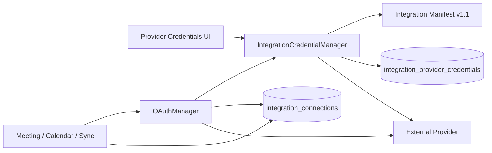
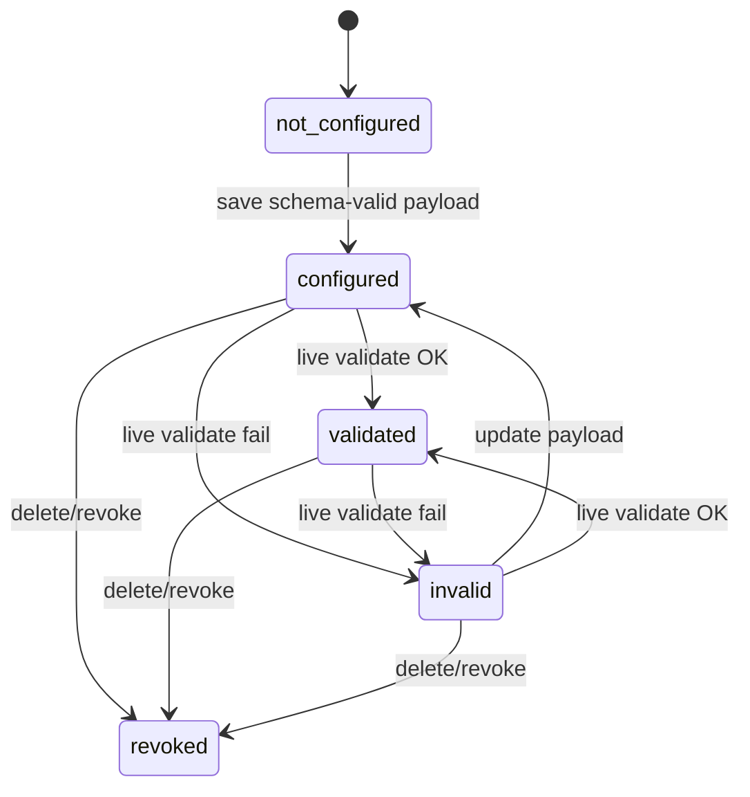
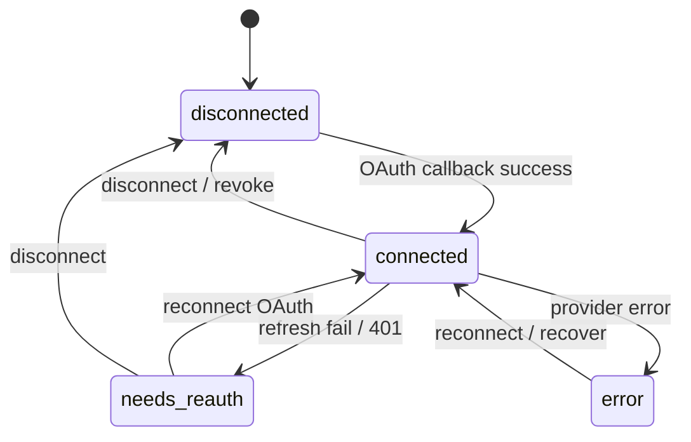

# Tenant-Owned Integration Credentials

> **Status: Architecture Frozen (Phase A approved 2026-07-20; Phase B documentation)**  
> Binding ADRs: [ADR-007](/architecture/adr/adr-007-tenant-owned-integration-credentials), [ADR-004 amendment](/architecture/adr/adr-004-oauth-architecture-amendment), [ADR-002 v1.1](/architecture/adr/adr-002-integration-manifest-v1-1-amendment), ADR-005.  
> Implementation: [Roadmap Phases C–G](./tenant-owned-credentials-implementation-roadmap) — **not started**.

SaleOS replaces **platform-owned** OAuth application credentials with **tenant-owned** Provider Credentials. This is a foundation correction before v1.0 — not a product feature.

## Glossary

| Term | Meaning |
|------|---------|
| **Provider Credentials** | Tenant-owned application secrets (`client_id`/`client_secret`, API keys, etc.) stored in `integration_provider_credentials` |
| **Connections Center** | Runtime authorization store (`integration_connections`) — tokens, status, health, external account |
| **Primary integration** | Manifest that owns credentials/connection rows (e.g. `google`, `microsoft`, `zoom`) |
| **Satellite integration** | Capability adapter that reuses a primary via `connection_integration` (e.g. `google-meet`) |
| **Validation** | Proves application credentials are acceptable to the provider (pre-OAuth / independent of user tokens) |
| **Health** | Proves a runtime connection token can call provider APIs |
| **Platform fallback** | Using env/`config()` OAuth client secrets when tenant credentials are missing — **forbidden** |
| **Fixed callback URL** | `{APP_URL}/oauth/callback/{provider}` — platform-owned redirect URI tenants register in their consoles |

## High-level architecture

```
┌──────────────────────────────────────────────────────────────────┐
│ Tenant Admin                                                     │
│  Provider Credentials UI  → Validate → Connect (OAuth)           │
└──────────────┬───────────────────────────────┬───────────────────┘
               │                               │
               ▼                               ▼
┌──────────────────────────────┐  ┌────────────────────────────────┐
│ IntegrationCredentialManager │  │ Connections Center             │
│ (application credentials)    │  │ (runtime authorization)        │
│ integration_provider_        │  │ integration_connections        │
│ credentials                  │  │ tokens · status · health       │
└──────────────┬───────────────┘  └────────────────┬───────────────┘
               │                                   │
               │  client_id / client_secret        │  access_token
               ▼                                   ▼
┌──────────────────────────────┐  ┌────────────────────────────────┐
│ OAuthManager + OAuthRegistry │  │ Meeting / Calendar / Sync /    │
│ PKCE · callback · refresh    │  │ Connection health checks       │
└──────────────────────────────┘  └────────────────────────────────┘
```

**Invariant:** Provider Credentials never store access/refresh tokens. Connections Center never stores OAuth application client secrets for OAuth providers. (API-key payloads on `integration_connections.credentials` remain only until Phase F — deferred until the first API-key provider.)

**Invariant:** No platform fallback for tenant integration app credentials.

**Out of scope:** Cashier, Creem, marketplace payments, `APP_KEY`, DB/Redis/queue/Reverb, central mail. Multi-provider email and payment gateway configs remain parallel stores until a future ADR-008.

## Responsibilities

| Component | Owns | Must not |
|-----------|------|----------|
| **IntegrationCredentialManager** | CRUD, encrypt, validate, rotate, mask, audit | Store tokens; start OAuth; call Meet/Calendar APIs |
| **OAuthManager** | PKCE, authorize, exchange, refresh, revoke tokens | Read platform env for tenant `client_id`/`client_secret` |
| **Connections Center** | Runtime auth rows, status, token health probes | Hold provider app secrets (post-migration) |
| **Integration Manifest v1.1** | `credential_schema`, flags, primary vs satellite | Hardcode env credential keys |
| **Meeting / Calendar / Sync** | Consume connection tokens via existing resolvers | Resolve client credentials |
| **Health Checks** | Runtime token / API reachability | Substitute for credential validation |
| **Admin UI** | Wizard, mask, rotate, gate Connect | Show raw secrets after save |

## Component diagram



## Lifecycle diagrams

### Provider Credential status (persisted)



### Connection status (persisted — existing enum)



### Derived Admin UX composite

Not stored. Computed from credential status + connection status + health. See [ADR-007](/architecture/adr/adr-007-tenant-owned-integration-credentials#derived-admin-ux-composite-not-stored).

## Provider Credential flow

1. Admin opens Provider Credentials for a **primary** integration (`google`, `microsoft`, `zoom`, …).
2. UI loads Manifest `credential_schema` from discovery API.
3. Admin pastes application credentials; secrets are write-only after save.
4. Save → status `configured` (schema validation).
5. Validate → status `validated` or `invalid`.
6. Connect remains disabled until `validated` (hard-block).

## OAuth flow

1. Credentials **validated** for the primary slug.
2. `POST /connections/{integration}/oauth/start` (existing Connections API).
3. `OAuthManager` loads app credentials **only** from `IntegrationCredentialManager`.
4. PKCE + state cached; browser → provider authorize URL.
5. Provider redirects to **fixed** `{APP_URL}/oauth/callback/{provider}`.
6. Code exchange uses tenant client id/secret; tokens saved on `integration_connections`.
7. SPA redirected to success path (default `/settings/connections`).

Tenants must register the SaleOS callback URL in **their** provider console.

## Connection flow

Unchanged consumer path:

1. Connection row Connected.
2. Meeting/Calendar resolvers load connection by primary slug (ADR-005).
3. `OAuthManager::refreshIfNeeded` uses tenant app credentials + refresh token.
4. Adapters call provider APIs with `access_token`.

## Validation flow

```
Save → schema validate → configured
                ↓
         POST …/validate
                ↓
    credential_validator / built-in probe
         ↙            ↘
   validated         invalid
         ↓
   Enable Connect
```

Health (`POST /connections/{id}/test`) remains a **token** probe — orthogonal to validation.

## Rotation flow

1. Admin with `provider_credentials.rotate` opens Rotate.
2. Submits new secret fields (omit unchanged).
3. Manager merges into encrypted payload; sets `rotated_at`.
4. Re-validate.
5. If `client_id` changed → related connections → `needs_reauth`.

## Administration flow

Recommended wizard steps:

1. Open provider developer console (docs link per integration).
2. Create OAuth app / API credentials.
3. Register SaleOS redirect URI checklist.
4. Paste credentials → Save → Validate.
5. Connect → complete OAuth.
6. Select provider in Meetings/Calendar settings as today.

## Permissions

| Permission | Purpose |
|------------|---------|
| `provider_credentials.view` | Status, masked fields, schema |
| `provider_credentials.manage` | Create / update / delete |
| `provider_credentials.validate` | Live validation |
| `provider_credentials.rotate` | Secret rotation |

Runtime connect/disconnect continues to use `connections.view` / `connections.manage` / `connections.manage_user`.

## Satellite rules

| Slug | Role | Credentials row |
|------|------|-----------------|
| `google` | Primary | Yes |
| `google-meet` | Satellite → `google` | No |
| `google-calendar` | Satellite → `google` | No |
| `microsoft` | Primary | Yes |
| `outlook-calendar` | Satellite → `microsoft` | No |
| `zoom` | Primary | Yes |
| `builtin` | `credential_type=none` | No |

## Current vs target

| Concern | Status |
|---------|--------|
| App credentials | Tenant `integration_provider_credentials` via IntegrationCredentialManager |
| User tokens | `integration_connections` (unchanged) |
| OAuth callback | Fixed platform URL (unchanged) |
| Manifest | v1.1 + `credential_schema` |
| Provider Credentials UI | Shipped (Phase E) |
| `/settings/connections` | Shipped (Phase E) |
| Platform env client secrets | **Deprecated and unbound** (Release Hardening) |
| API-key migration (Phase F) | **Deferred** — no production API-key providers yet |

## Phase F — Deferred

**Status:** Deferred  
**Reason:** No production API-key providers currently exist. Migration of `integration_connections.credentials` will be implemented together with the first API-key based integration.

## Phase E / Release Hardening status (2026-07-20)

Phases C–E delivered. Release Hardening removes obsolete env credential bindings and locks architecture with Pest guards. Phase F not required for OAuth v1.0.

## Related

- [ADR index](/architecture/adr/)
- [Implementation Roadmap](./tenant-owned-credentials-implementation-roadmap)
- [Integration Framework](./integration-framework)
- [Tenant Integrations API](/api/tenant-v1-integrations)
- [Documentation Review](/architecture/adr/documentation-review-tenant-owned-credentials)
