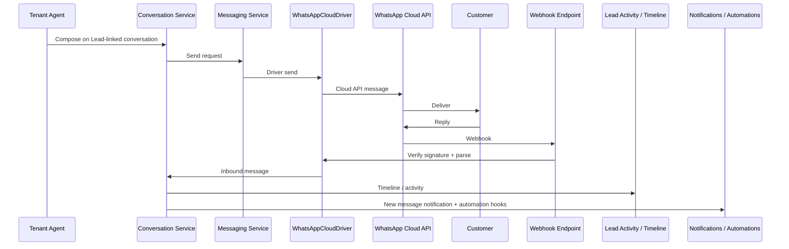

# WhatsApp Cloud Integration

> **Status: Planned — not implemented**
>
> This document is the **official architectural blueprint** for a future WhatsApp Cloud API integration. No Cloud API send/receive, conversations, webhooks, or shared inbox exists in application code today. Do not treat any class name, entity, route, or UI path below as shipped runtime behavior until an implementation PR lands and this status is updated.
>
> When implementation begins, follow the [Module Architecture](/architecture/module-architecture), [Module Development Standard](/developer-guide/module-development), [Documentation Governance](/developer-guide/documentation-governance) same-PR rule, the frozen [Notification Architecture Contract](/developer-guide/notification-architecture-contract), and complementary blueprints: [Lead Source Driver Architecture](/developer-guide/lead-source-driver-architecture) and [Meta Lead Ads Integration](/developer-guide/meta-lead-ads-integration).

---

## Purpose

Evolve SaleOS from a **manual WhatsApp handoff** (`wa.me`) into a complete **WhatsApp communication platform** built on the official **WhatsApp Cloud API**, while keeping business logic inside SaleOS and provider specifics inside replaceable drivers.

**Goals (future):**

- Connect tenant WhatsApp Business Accounts and phone numbers via Meta
- Send and receive messages through SaleOS (not the user’s personal WhatsApp client)
- Conversations, shared inbox, templates, media, delivery/read status
- Link conversations to Leads; surface messages on the Lead timeline
- Automation and notifications on the existing platform contracts
- Remain compatible with platform freeze (no foundation redesign)

**Non-goals for this document:**

- Implementing Cloud API, migrations, endpoints, or UI now
- Replacing Communication Templates’ `wa.me` MVP before Cloud API ships
- Making WhatsApp the only messaging channel forever (drivers must stay replaceable)

---

## Current state

SaleOS **already** supports a lightweight WhatsApp handoff via [Communication Templates](/developer-guide/communication-templates):

| Shipped today | Behavior |
|---------------|----------|
| WhatsApp button on Lead pages | Shown when Communication Templates is installed, user has `use` permission, and the lead has a valid phone |
| Opens `wa.me` / WhatsApp Desktop / WhatsApp Web | API returns `wa_me_url`; the browser opens it |
| User manually sends messages | The agent completes send inside WhatsApp; SaleOS does not transmit the message |

This is **not** a WhatsApp API integration.

### Not supported today

| Capability | Status |
|------------|--------|
| Sending through SaleOS | ❌ Not supported |
| Receiving replies | ❌ Not supported |
| Delivery status | ❌ Not supported |
| Read receipts | ❌ Not supported |
| Media synchronization | ❌ Not supported |
| Conversations | ❌ Not supported |
| Shared inbox | ❌ Not supported |
| Meta message templates (Cloud API) | ❌ Not supported (plain-text Communication Templates only) |
| Webhooks | ❌ Not supported |
| Automation driven by WhatsApp events | ❌ Not supported |

Canonical user docs: [Communication Templates](/user-guide/communication-templates) · [Leads — WhatsApp](/user-guide/leads#whatsapp-communication-templates).

---

## Vision

SaleOS should become a complete WhatsApp communication platform on the official WhatsApp Cloud API.

Future capabilities include:

- Connect WhatsApp Business Account
- Multiple phone numbers
- Multiple business accounts
- Send messages
- Receive messages
- Message templates (Meta-approved Cloud API templates)
- Media support
- Contact synchronization
- Conversation history
- Shared inbox
- Team assignment
- Internal notes
- Automation
- Campaign messaging
- Activity timeline
- Notifications

The existing `wa.me` flow remains a valid fallback until Cloud API connect + send is production-ready for a tenant.

---

## Architecture

### Outgoing (high level)

```text
Lead
    ↓
Conversation
    ↓
Messaging Service
    ↓
WhatsApp Driver
    ↓
WhatsApp Cloud API
    ↓
Meta
```

### Incoming (high level)

```text
Meta Webhook
    ↓
Webhook Verification
    ↓
WhatsApp Driver
    ↓
Conversation Service
    ↓
Lead Activity
    ↓
Notifications
    ↓
Automation
```

### Component map (planned)

| Component | Responsibility |
|-----------|----------------|
| Messaging Service | Provider-agnostic send/receive orchestration, queueing, retries |
| Conversation Service | Thread lifecycle, assignment, inbox queries, link to Lead |
| `WhatsAppCloudDriver` | Cloud API auth, webhooks, templates, media, status mapping |
| Lead module | Lead ownership, timeline/activity hooks via `LeadService` / activity services — not Graph parsing |
| Notification system | In-app / mail digests per [Notification Architecture Contract](/developer-guide/notification-architecture-contract) |
| Automation Engine | Future workflow reactions to message events |

Business rules (who may send, assignment, logging, automation) stay in SaleOS. Drivers only speak to external providers.

---

## Driver architecture

WhatsApp follows the platform **driver** pattern (same Open/Closed idea as payment gateways, email drivers, and [Lead Source Driver Architecture](/developer-guide/lead-source-driver-architecture)).

### Messaging provider driver

Future primary driver:

**`WhatsAppCloudDriver`**

Messaging providers should be **replaceable**. Conversation Service and Messaging Service depend on a messaging-driver contract — not on Meta SDK types leaking into controllers or Lead models.

| Future messaging driver | Role |
|-------------------------|------|
| WhatsApp Cloud | Official Meta Cloud API (primary) |
| Twilio WhatsApp | Alternate BSP / Twilio channel |
| 360dialog | BSP adapter |
| Infobip | BSP adapter |
| MessageBird | BSP adapter |

Drivers only communicate with external providers. They must **not** own assignment, inbox permissions, Lead business rules, or notification fan-out.

### Lead Source Driver (related, separate concern)

Inbound WhatsApp can also create or enrich leads (e.g. first message from an unknown number). That path uses the [Lead Source Driver Architecture](/developer-guide/lead-source-driver-architecture) catalog entry **WhatsApp Driver** → `NormalizedLeadData` → `LeadDuplicateService` → `LeadService`.

| Concern | Driver family |
|---------|---------------|
| Send/receive messages, status, media | Messaging drivers (`WhatsAppCloudDriver`, …) |
| Turn an inbound contact into a Lead | Lead Source Driver (WhatsApp) |

Do not collapse both into a single class that writes Leads and messages directly.

---

## Authentication

Documented Meta / OAuth-style onboarding (planned):

```text
Tenant
    ↓
Connect Meta
    ↓
Select Business
    ↓
Select WhatsApp Business Account
    ↓
Select Phone Number
    ↓
Store encrypted tokens
    ↓
Subscribe Webhooks
    ↓
Ready
```

| Operation | Behavior |
|-----------|----------|
| **Reconnect** | Re-run OAuth; refresh tokens; re-select WABA / phone if needed; re-subscribe webhooks; mark healthy |
| **Disconnect** | Unsubscribe webhooks where possible; clear encrypted tokens; leave historical conversations/messages intact |
| **Token refresh** | Refresh before expiry; on failure mark `needs_reauth` and pause outbound/inbound processing for that number |

Central holds the platform Meta App configuration. Each tenant owns its own connection, WABA selection, phone numbers, and encrypted secrets (same secret-handling patterns as payment / mail / Meta Lead Ads).

---

## Multi-tenant design

Each tenant owns:

| Tenant-owned asset | Notes |
|--------------------|-------|
| Meta connection | OAuth / embedded signup linkage |
| Business Account | Selected Meta Business / WABA |
| Phone numbers | One or more WhatsApp Business phone numbers |
| Templates | Synced Meta message templates for that WABA |
| Tokens | Encrypted access tokens / secrets |
| Webhook subscriptions | Per-number or app-level subscription state scoped to the tenant |

**No tenant data may be shared.** Shared webhook ingress must resolve the tenant by phone number ID / WABA identifier (or equivalent Meta routing key) **before** Conversation Service runs. Enforce uniqueness of phone number ID → tenant at connect time.

---

## Messaging flow

### Outgoing

```text
Lead
    ↓
Compose Message
    ↓
Conversation Service
    ↓
WhatsApp Driver
    ↓
Meta API
    ↓
Customer
```

### Incoming

```text
Customer
    ↓
Meta Webhook
    ↓
Driver
    ↓
Conversation Service
    ↓
Lead Timeline
    ↓
Notification
    ↓
Automation
```

### Sequence (conceptual)



---

## Conversation model

Conceptual entities only — not a finalized schema.

| Entity | Intent |
|--------|--------|
| **Conversations** | Thread between a tenant phone number and a customer WhatsApp identity |
| **Messages** | Individual inbound/outbound items with type, body, status, timestamps |
| **Attachments** | Media references (prefer encrypted / storage refs; avoid unbounded blob storage in DB) |
| **Participants** | Customer + tenant agents involved |
| **Statuses** | Queued → sent → delivered → read / failed / expired |
| **Assignments** | Which agent/team owns the conversation |
| **Internal Notes** | Agent-only notes not sent to WhatsApp |
| **Conversation Labels** | Tags for inbox filtering and routing |

Exact table names, UUIDs, and indexes are deferred to the implementation PR. Prefer linking `conversation.lead_id` (nullable) rather than duplicating Lead contact fields.

---

## Message types

Support roadmap:

| Type | Notes |
|------|-------|
| Text | Default body |
| Image | Media download/upload via driver |
| Video | Media |
| Audio | Media / voice notes |
| Document | Files |
| Sticker | Stickers |
| Location | Lat/long + optional name |
| Contacts | Shared contact cards |
| Interactive Buttons | Reply buttons |
| Lists | List messages |
| Template Messages | Meta-approved templates outside the 24h session window |

Drivers map provider payloads into a common internal message type enum; UI and Conversation Service consume the common type.

---

## Message status

Future support for delivery lifecycle:

| Status | Meaning |
|--------|---------|
| Queued | Accepted by SaleOS; not yet accepted by Meta |
| Sent | Accepted by Cloud API |
| Delivered | Delivered to customer device |
| Read | Read receipt (when available) |
| Failed | Permanent or terminal failure |
| Expired | Expired per Meta / session rules |

Status webhooks update the Message entity idempotently (by Meta message ID). Drivers translate provider statuses; Conversation Service persists them.

---

## Lead integration

Every conversation should be linked to a **Lead** whenever possible (match by phone / prior thread / explicit agent link).

Messages should automatically appear inside:

- Lead Timeline
- Activities
- Future Communication History

| Rule | Detail |
|------|--------|
| Write path | Lead activity / timeline updates go through Lead-owned services — not raw inserts from the WhatsApp driver |
| Unknown numbers | May create or attach a Lead via the WhatsApp **Lead Source Driver** + `LeadService` |
| Independence | Messaging can exist without Meta Lead Ads; Lead Ads can exist without WhatsApp Cloud |

---

## Templates

Two template concepts must stay distinct:

| Kind | Today / future |
|------|----------------|
| **Communication Templates** (shipped) | Tenant plain-text snippets for `wa.me` handoff |
| **WhatsApp Cloud templates** (future) | Meta-approved templates synced from WABA |

Future Cloud template support:

- Sync Meta templates into the tenant
- Approval status (pending / approved / rejected)
- Languages
- Variables / placeholders
- Categories (utility, marketing, authentication — per Meta rules)

Sending outside the customer service window requires an approved Cloud template. Communication Templates may later feed copy into Cloud template variables, but they are not the same store.

---

## Automation

Future examples (Automation Engine / workflows — not implemented):

- Send welcome message
- Follow-up reminders
- Missed appointment reminder
- Payment reminder
- Birthday greeting
- Drip campaigns
- Workflow automation (if message received → create Task / change Lead stage)

Automations subscribe to Conversation / Message domain events. Drivers do not embed business workflows.

---

## Notifications

Future notifications include:

- New incoming message
- Unread conversations
- Failed delivery
- Template rejection

Integrate with the existing notification system ([Notification Architecture Contract](/developer-guide/notification-architecture-contract)): additive `type` / `metadata` / `source` fields; Reverb fan-out where `broadcast_ready`; no parallel notification framework.

---

## Security

| Control | Requirement |
|---------|-------------|
| Webhook signature verification | Verify Meta/`X-Hub-Signature-256` (or current Meta WhatsApp signature scheme) before trusted processing |
| Encrypted tokens | WABA / phone tokens encrypted at rest; APIs return masks only |
| Encrypted media references | Store storage keys / signed URLs carefully; do not log raw media binaries |
| Queue processing | Acknowledge webhooks quickly; process on a dedicated queue |
| Rate limiting | Throttle outbound Cloud API calls; respect Meta rate limits |
| Idempotent webhook handling | Deduplicate by Meta message / status IDs |
| Audit logging | Platform audit for connect/disconnect, send failures, permission changes |
| Permission checks | Tenant RBAC for inbox, send, manage connection, manage templates |

CSRF-exempt webhook route under a narrow prefix (same operational pattern as payment / email / Meta Lead Ads webhooks).

---

## Error handling

| Scenario | Expected behavior |
|----------|-------------------|
| Expired tokens | Mark connection `needs_reauth`; pause send/receive for affected numbers; alert tenant admins |
| Revoked permissions | Same as expired tokens; surface which scope failed |
| Deleted phone numbers | Mark number unhealthy; stop routing; keep history |
| Rate limiting | Back off; queue outbound; surface soft errors to agents |
| Webhook retries | Idempotent processing; prefer 2xx after durable claim |
| Duplicate webhooks | No duplicate Message rows |
| Temporary Meta outages | Retry with backoff; dead-letter after exhaustion |
| Dead-letter queues | Operator visibility + manual replay |
| Retry strategy | Exponential backoff; distinguish transient vs permanent Graph errors |

---

## Permissions (Meta platform)

Future production requirements (Meta side):

- Business Verification
- App Review
- WhatsApp Business Account
- Phone Number verification
- Appropriate WhatsApp Cloud API permissions / products enabled on the Meta App

Local development may use Meta test numbers / development mode without full public Live Mode access. Document tunnel + webhook verify token setup at implementation time.

Tenant RBAC permissions (SaleOS side) are TBD at implementation (e.g. inbox view/send, connection manage) and must follow `module:` + `can:` conventions.

---

## Future enhancements

Placeholders after core Cloud send/receive and inbox:

| Enhancement | Intent |
|-------------|--------|
| AI auto replies | Optional AI responses |
| AI message summaries | Thread summaries for agents |
| Suggested replies | Agent assist |
| Sentiment analysis | Conversation scoring |
| Voice transcription | Voice notes → text |
| Conversation analytics | Volume, response time, outcomes |
| Broadcast campaigns | Opt-in bulk messaging within Meta rules |
| Chatbot builder | Visual flows on top of Conversation Service |
| Multi-agent inbox | Concurrent agents, presence |
| Team workload balancing | Assignment algorithms |
| CRM triggers | Stage/status changes from message events |
| Calendar integration | Book from chat ([Meetings](/getting-started/product-roadmap) dependency when relevant) |
| Task creation from messages | Create Tasks from a thread |
| Voice notes transcription | Same as voice transcription track |

AI features remain **optional** integrations per [Module Dependencies](/architecture/module-dependencies).

---

## Relationship with Meta Lead Ads

[Meta Lead Ads](/developer-guide/meta-lead-ads-integration) and WhatsApp Cloud are **complementary**, not substitutes.

```text
Meta Lead Ads
    ↓
Lead
    ↓
Lead Service
    ↓
Conversation
    ↓
WhatsApp Cloud
```

| Integration | Job |
|-------------|-----|
| Meta Lead Ads | Ingest form submissions → Lead (`MetaLeadAdsDriver` + Lead Source pipeline) |
| WhatsApp Cloud | Communicate with the customer on WhatsApp (`WhatsAppCloudDriver` + Conversation Service) |

Lead generation and customer communication remain **independent** modules/capabilities connected through the **Lead** entity. Either can ship without the other. Shared Meta App configuration may be reused at the platform level, but tenant Page tokens (Lead Ads) and WABA/phone tokens (WhatsApp) stay separate connection records.

Both respect driver boundaries: no Meta parsing inside `LeadService`; no conversation business rules inside Graph clients.

---

## Relationship with Lead Source Driver Architecture

- Messaging: `WhatsAppCloudDriver` (messaging provider contract).
- Optional lead capture from WhatsApp: catalog **WhatsApp Driver** under [Lead Source Driver Architecture](/developer-guide/lead-source-driver-architecture).
- Never bypass `LeadService` when creating leads from WhatsApp.

---

## Implementation checklist (when building)

### Backend

- [ ] Central Meta App settings for WhatsApp Cloud (encrypted secrets, verify token)
- [ ] Tenant connect / reconnect / disconnect + encrypted WABA/phone tokens
- [ ] `WhatsAppCloudDriver` + messaging driver registry
- [ ] Webhook verify + signature rejection path + tenant resolution by phone/WABA id
- [ ] Conversation / Message conceptual model → real migrations
- [ ] Outbound send queue + inbound process queue + idempotency
- [ ] Lead timeline / activity integration via Lead-owned services
- [ ] Template sync from Meta
- [ ] Notification types for inbound / failed / template rejection
- [ ] Pest: signature, tenancy, idempotency, no direct Lead DB writes from driver

### Frontend

- [ ] Connection wizard (Business → WABA → phone)
- [ ] Shared inbox + conversation thread on Lead
- [ ] Compose send + template picker (Cloud templates)
- [ ] Playwright smokes with mocked Cloud API

### Docs / ops

- [ ] Flip this page from Planned → shipped sections
- [ ] User Guide + Deployment webhook/env notes
- [ ] CHANGELOG + Product Roadmap status

---

## Implementation status

### Current

| Capability | Status |
|------------|--------|
| Open WhatsApp manually (`wa.me` / Desktop / Web) | ✅ Shipped |

### Future

| Capability | Status |
|------------|--------|
| Cloud API | ⬜ Planned |
| Incoming messages | ⬜ Planned |
| Shared Inbox | ⬜ Planned |
| Templates (Meta Cloud) | ⬜ Planned |
| Automation | ⬜ Planned |
| Conversation History | ⬜ Planned |
| Delivery Tracking | ⬜ Planned |
| Read Receipts | ⬜ Planned |
| Media | ⬜ Planned |
| AI Features | ⬜ Planned |

This document is an **architectural roadmap only**. No implementation, migrations, API endpoints, or UI are implied by publishing it.

---

## Related

- [Lead Source Driver Architecture](/developer-guide/lead-source-driver-architecture)
- [Meta Lead Ads Integration](/developer-guide/meta-lead-ads-integration)
- [Communication Templates](/developer-guide/communication-templates) (current `wa.me` MVP)
- [Leads — Developer Guide](/developer-guide/leads)
- [Notification Architecture Contract](/developer-guide/notification-architecture-contract)
- [Payment Gateway Webhooks](/developer-guide/payment-gateways-webhooks) (ingress / signature patterns)
- [Email provider webhooks](/developer-guide/email-webhooks) (multi-tenant webhook patterns)
- [Product Roadmap](/getting-started/product-roadmap)
- [Module Architecture](/architecture/module-architecture)
- [Module Dependencies](/architecture/module-dependencies)
- [Documentation Governance](/developer-guide/documentation-governance)
