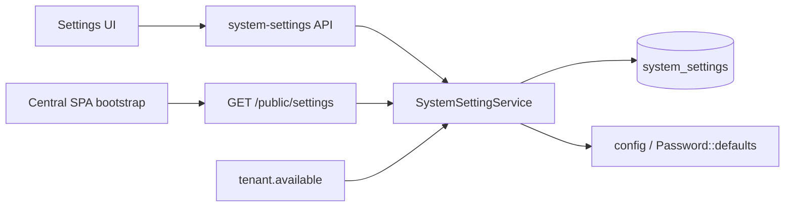

# Central Application Settings

Runtime-applied platform settings for the Central admin console and Tenant Application gates. Stored as key/value rows in `system_settings`, edited under **Settings** in the Central UI.

Payment gateway credentials live under **Billing → Payment Gateways** — not Settings.

## Guides

| Audience | Document |
|----------|----------|
| Operators (admin UI) | [settings-user.md](/user-guide/central-settings) |
| Engineers | [settings-developer.md](/developer-guide/central-settings) |
| Production / ops | [settings-production.md](/deployment/central-settings) |
| Object storage (Wasabi / S3) | [object-storage.md](/developer-guide/object-storage) |
| Tenant workspace settings | [tenant-settings.md](/user-guide/tenant-settings-overview) |

## Groups

| Group | Purpose |
|-------|---------|
| **General** | Application Name, Company Name, timezone/locale/currency, registration |
| **Localization** | Date + time formats (Central SPA) |
| **Mail** | SMTP + From identity + test email |
| **Branding** | Button color, support email, logo/favicon |
| **Security** | Session timeout, password policy |
| **Maintenance** | Tenant Application only |
| **Billing** | Invoice prefix, proration, trial/Stripe flags, default gateway code |

## Runtime model

- Central never enters Laravel `artisan down` from `maintenance_mode`.
- Self-service registration is gated by `registration_enabled` (API + `/register` page).
- Sensitive `mail_password` is encrypted at rest and masked as `********` in the admin list.
